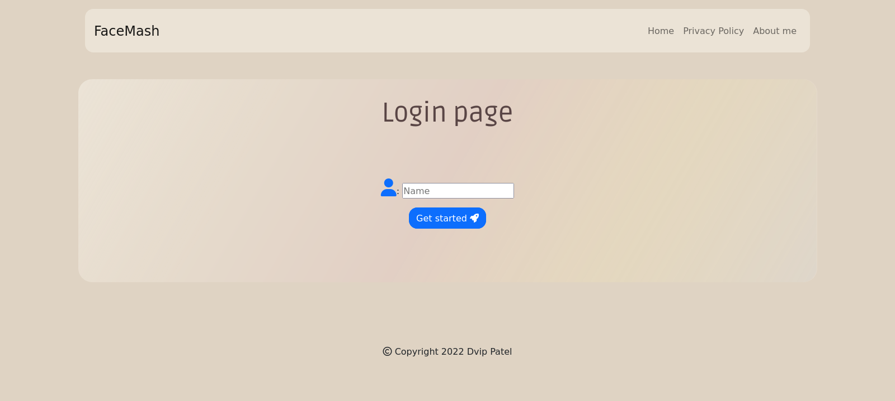

# faceMash
A simple faceMash app is build using Node.js, Express.js, MongoDB, Mongoose, EJS, Bootstrap, HTML, CSS, JavaScript.

## Introduction
This is a project that allows users to compare teachers at their school and determine who is the best according to their classmates. It was inspired by the infamous faceMash that Mark Zuckerberg created in his college days, but with a twist. Instead of comparing people based on their looks, the project compares teachers using the chess Elo algorithm and a Swiss tournament system.

## Techlogy Stack
- Node.js
- Express.js
- MongoDB
- Mongoose
- EJS
- Bootstrap
- HTML
- CSS
- JavaScript

## Features 
- Allows users to compare teachers at their school and determine who is the best according to their classmates.
- The project compares teachers using the chess Elo algorithm and a Swiss tournament system.
- The project uses a MongoDB database to store the data.   
- The project uses EJS to render the HTML pages.
- The project uses Bootstrap to make the pages responsive.

## Installation
- Clone the repository `git clone https://github.com/dvip1/faceMash.git`
- Install the dependencies `npm install`
- Run the server `npm start`
- Open the browser and go to `http://localhost:3000`

## Contributing
- Fork the repository
- Clone the repository `git clone  https://github.com/<user-name>/faceMash.git`
- Create a new branch `git checkout -b <branch-name>`
- Make the changes
- Commit the changes `git commit -m "<commit-message>"`
- Create a pull request

## License
This project is licensed under the MIT License - see the LICENSE.md file for details

## Acknowledgments
- Hat tip to anyone whose code was used
- Inspiration
- etc

## Screenshots

